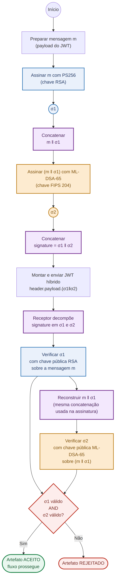
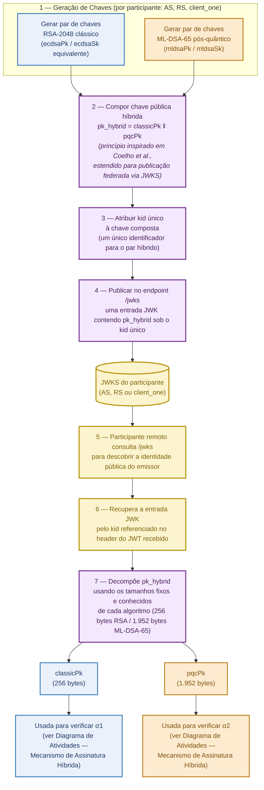

# Consolidated Technical Architecture

## Experiment 3 — Hybrid Signature Scheme (PS256 + ML-DSA-65) via Strong Nesting

Luciano Figueiredo Coelho | PPGCC/LabSEC/UFSC

## 1. Objective

This document brings together the definitive architecture of Experiment 3 — the hybrid signature scheme that combines PS256 (classical) and ML-DSA-65 (post-quantum) in the OPIN consent flow. Each decision is explained directly, in plain language, with the scientific reference that supports it.

## 2. Central Principle

The SAD (Slide 14 — Hybrid Signature Mechanism) defines the base idea: every artifact signed in the flow — the token the client uses to identify itself, the tokens issued by the Authorization Server, the Data Server's responses — now carries two signatures at once, one classical and one post-quantum. Whoever receives that artifact only accepts it if both signatures are valid. If either one fails, the whole artifact is rejected.

## 3. Composition Mechanism — Strong Nesting

The two signatures are not generated independently — they are chained, following the technique called Strong Nesting (Bindel, Herath, McKague & Stebila, 2017, PQCrypto). The process has two steps.

First, the message is signed with PS256, producing σ1 ("sigma one"). Then, instead of signing the original message again, the ML-DSA-65 algorithm signs the message together with σ1 — that is, the second signature "embraces" the first. The final result transmitted is σ1 followed by σ2 ("sigma two").

This binding between the two signatures is what distinguishes Strong Nesting from simple concatenation, where the two signatures would be generated separately, with no relationship between them. With chaining, nobody can take a valid σ1 and swap in a σ2 from another message — the combination is only valid if both pieces belong exactly to each other.

Bindel et al. (2017) formally prove that this technique guarantees a stronger security level (called SUF-CMA) than simple concatenation, which only guarantees a weaker level (EUF-CMA). Janneck (2025) confirms this same result with a more recent proof.

Verification follows the same logic, in reverse order: first it verifies σ1 against the original message; then it reconstructs "message + σ1" and verifies σ2 against that reconstruction. Only if both verifications pass is the artifact accepted.

### How to read Figure 1

The diagram has two halves. The top half shows what happens when a message is signed; the bottom half shows what happens when it is verified by the receiving side.

The blue boxes are operations of the classical algorithm (PS256). The orange boxes are operations of the post-quantum algorithm (ML-DSA-65). The purple boxes are the concatenation steps, where two pieces of information are glued into one. At the end, the red diamond is the decision point: it only proceeds to "accepted" if both prior verifications succeeded.

Follow the arrows from top to bottom: the message enters at the top, goes through the two signatures in sequence — first the blue one, then the orange one, because the orange one depends on the blue one's result — comes out as a ready token, is received on the other side, goes through the two verifications in the same order, and ends at the decision diamond.

*Figure 1 — UML Activity Diagram: signing and verification mechanism via Strong Nesting*

## 4. Justification for the AND Gate

Verification requires that both signatures be valid, not just one. To forge an artifact, an attacker would need to break PS256 and ML-DSA-65 at the same time — as long as at least one of the two remains secure, the scheme holds (Bindel et al., 2017).

This choice is also reinforced by the maturity gap between the two algorithms. PS256/RSA has accumulated decades of use and attack attempts, with no known structural failures. ML-DSA, standardized by NIST in 2024, is still in an early phase of validation by the scientific community. If the system accepted either signature in isolation, it would only take compromising the weaker of the two algorithms to forge an accepted artifact — requiring both to be valid uses the classical algorithm's maturity as a safety net while the post-quantum one accumulates the same amount of validation time.

**References:** Bindel, N., Herath, U., McKague, M., Stebila, D. "Transitioning to a Quantum-Resistant Public Key Infrastructure." PQCrypto 2017. — Janneck, J. "Bird of Prey: Practical Signature Combiners Preserving Strong Unforgeability." 2025 (Springer, DOI 10.1007/978-3-032-25317-0_8).

## 5. Hybrid JWT Header Format

Every JWT has an initial part (the header) that says which algorithm was used to sign it and which key to use to verify it. In the hybrid scheme, the field that identifies the algorithm now declares the combination: `MLDSA65-RSA2048-PSS-SHA256`. The RSA component stays at 2048 bits — not 3072 bits, as would be recommended to match ML-DSA-65's security level — to keep direct continuity with what was already measured in Experiments 1 and 2.

This algorithm combination always means Strong Nesting in this project — there is no ambiguity about which method to use at verification time, because this convention is documented in the architecture, not hidden in the code. The key identifier (`kid`) is unique, pointing to the composed hybrid public key, explained in the next section. Since no off-the-shelf library recognizes this combined algorithm, verification remains a custom implementation — the same path the thesis has already followed since Experiment 2.

**Addendum — two cases where this header convention does not apply, for two different reasons.** The combined `alg` string above describes artifacts issued by the Authorization Server or the Data Server *through the normal path*, where the issuer holds the private key and can freely choose the header it signs.

*Client-to-AS artifacts* (the client assertion, and the PAR request object) no longer use Strong Nesting at all — the advisor proposed a different composition for this one direction, adopted as a deliberate trade-off (Decision 13). Instead of chaining the two signatures, the post-quantum signature is embedded as an extra claim inside the message the classical signature already covers: ML-DSA-65 signs the RFC 8785 (JSON Canonicalization Scheme, JCS) canonical bytes of the claims before that extra claim exists; the result is added as `claims.pqc = {alg: "ML-DSA-65", signature: ...}`; and RSA signs the claims-with-`pqc` last, as an entirely ordinary RS256 JWT. The header is `alg: "RS256"`, not `PS256` — a deliberate choice for maximal compatibility with verifiers that have never heard of the post-quantum extension, since the result is byte-for-byte a valid classical JWT carrying one extra, ignorable claim. No custom `alg` string, no signature-length tell, no truncation before the OIDC library ever sees it — a legacy verifier accepts this token exactly as it would a purely classical assertion.

This composition trades Strong Nesting's SUF-CMA (strong unforgeability) for the weaker EUF-CMA (existential unforgeability) on this one direction: nothing here stops a second, different signature from being produced over an already-signed message — the property SUF-CMA specifically defends against. The trade is deliberate and scoped: client assertions and PAR request objects are single-use and short-lived (a fresh `jti`/`exp` every time, replay-checked by the AS), so SUF-CMA's guarantee has nothing left to add here in practice. **References:** Bindel, Herath, McKague & Stebila (2017, PQCrypto — the Strong Nesting composition and its SUF-CMA proof, the standard being relaxed here); Bindel, Braun, Gladiator, Stebila & Wiggers (2019, JOSS — the same extension-based principle already used for the X.509 hybrid certificate in Section 7, applied here to a JWT payload instead); Brendel, Cremers, Jackson & Zhao (2021, IEEE S&P, "The Provable Security of Ed25519" — SUF-CMA vs. EUF-CMA in practice, and why protocol-level context often makes the weaker property sufficient). See `DECISIONS.md`, Decision 13, for the full reasoning, the JCS-canonicalization requirement this composition depends on, and the JWKS backward-compatibility gap it exposed and closed.

*The id_token* stays `alg: "PS256"` too, but for a completely different reason, and — unlike the client-to-AS artifacts above — it still uses Strong Nesting, unaffected by Decision 13: the underlying OIDC library validates the client's registered signing-algorithm metadata against its own fixed table of recognized algorithms *before* the actual signing step runs at all, and rejects anything it doesn't recognize — including the combined alg string. Since the id_token is also immediately wrapped in encryption before it ever leaves the library's internal code, this project's usual after-the-fact response interception (which handles every other AS-issued artifact) can't reach it either: it's already an encrypted envelope by the time that interception point runs. The library does, however, offer an official extension point for supplying the actual signature bytes for a given key -- that's where Strong Nesting is substituted in for the id_token, still under an ordinary `alg: "PS256"` header the library itself required. Its signature segment's decoded length (3565 bytes, σ1‖σ2, instead of 256) is now the only place in the whole flow where that particular tell still applies, since client-to-AS artifacts no longer carry it. See `DECISIONS.md`, Decision 10.

## 6. Hybrid Public Key Architecture

To verify both signatures, whoever receives the artifact needs to be able to find both public keys of whoever signed it. Each participant's public identity — Authorization Server, Data Server, or the client itself — now becomes the junction of both keys into one, published under a single identifier at the public address where the keys are available (the `/jwks` endpoint). Whoever receives the artifact queries that address, takes that joint key, and splits it back into its two parts, because each algorithm has a fixed, known size — the split is never ambiguous.

This principle of joining two keys into one already exists in the literature, applied to blockchain accounts (Coelho et al.), where the key is obtained mathematically from the account's own address, with no need for a public lookup location. OPIN has a different problem: several participants need to discover each other's keys through a public address on the internet. This application of the principle to a public-discovery scenario does not yet appear in the reviewed literature, and is an original contribution of this thesis.

### How to read Figure 2

This diagram is not about signing a message — it's about how each participant prepares and publishes its digital identity, so that others can verify it later.

The yellow band at the top shows the starting point: each participant generates two key pairs, one classical and one post-quantum. The purple boxes show what happens to those keys — they are glued into a single composed key, receive a single identifier, and are published at a public address any participant can query. The yellow cylinder represents that publication location, like a repository.

From the middle down, the diagram shows the reverse path: another participant, upon receiving a signed token, needs to discover the public key of whoever signed it. It queries the repository, retrieves the composed key, and splits it back into its two original parts. The two boxes at the end, blue and orange, show where those split keys go: feeding exactly the two verification steps that appear in Figure 1.

*Figure 2 — Composition, publication, and discovery architecture for hybrid public keys via JWKS*

## 7. Hybrid mTLS Certificate

The client certificate and the gateway server certificate follow the same chaining principle from Section 3, adapted by Bindel et al. (2019) for the specific case of certificates — but in reverse order relative to Section 3, for a practical reason: a traditional verifier, one that does not understand PQC, only checks a single signature — the one that already exists today, in the certificate's standard field. For nobody to be able to swap the post-quantum material without being noticed even by that old verifier, that single classical signature needs to cover everything, including the new fields. That is why the post-quantum signature is computed first, over the certificate while it is still incomplete (without the field that will hold that signature itself); only afterward, with that field already filled in, is the classical signature computed last, over the now-complete certificate, with all the new fields included.

These two signatures are physically stored in the certificate through three additional, non-mandatory fields (Bindel et al., 2019): one carries the ML-DSA-65 public key, another carries the post-quantum signature, and the third identifies which post-quantum algorithm was used. Because they are non-mandatory, an old system that does not yet understand PQC simply ignores them and keeps validating the certificate via the normal RSA signature — nothing breaks for whoever hasn't migrated yet, and that RSA signature, by covering the now-complete certificate, also protects the new fields against tampering, even for someone who doesn't know how to verify them. The local certificate authority signs the certificate twice: first with ML-DSA-65, over the certificate still without its own post-quantum-signature field; then with RSA, as it always has, but now last, already over the complete certificate.

**References:** Bindel, N., Herath, U., McKague, M., Stebila, D. "Transitioning to a Quantum-Resistant Public Key Infrastructure." PQCrypto 2017. — Bindel, N. et al. "X.509-Compliant Hybrid Certificates for the Post-Quantum Transition." Journal of Open Source Software, 4(40), 1606, 2019.

## 8. Mapping to Already-Implemented Components

The hybrid architecture fully reuses what was already built and validated in Experiments 1 and 2 — no component needs to be built from scratch.

| Component | Reused from Experiments 1/2 | Extension for Experiment 3 |
|---|---|---|
| Authorization Server (Node.js, jose v6) | Signs with PS256 or ML-DSA-65, per `CRYPTO_PROFILE`. | Signs with PS256, concatenates with the message, signs the result with ML-DSA-65 — activated by `CRYPTO_PROFILE=hybrid`. |
| Resource Server (Java, BouncyCastle 1.79) | `ResponseSigningFilter` already signs responses with PS256 or ML-DSA-65. | Same chaining logic applied to the already-existing filter. |
| mTLS certificate (client and gateway) | Pure PQC certificates already generated and validated (`client_one_pqc`, `op_pqc`, `mtls_pqc`). | Classical certificate with three non-critical X.509 extensions carrying the chained post-quantum layer (Section 7). |
| Configuration (`CRYPTO_PROFILE`) | Switches between `classic` and `pqc`, one `crypto-profiles/*.json` at a time. | New `hybrid` value activates the chained-signing routine in each component. |
| Verification (on both sides) | Verifies one signature at a time. | Verifies σ1, reconstructs m‖σ1, verifies σ2 against that reconstruction, applies the AND gate. |
| Metrics and pipeline (`opin_flow.py`, OPINsize Equation) | Valid and fully reused. | Produce a third set of values, using the new JWT, handshake, and key sizes as input to the same equation. |

## 9. Experimental Methodology

Experiment 3 keeps the same 6 latency scenarios from Experiments 1 and 2 (0ms, 14ms, 30ms, 140ms, 225ms, 320ms), so the comparison across the three experiments stays direct. The goal here is to confirm that the hybrid architecture genuinely works and produces an overhead consistent with what is already known about each algorithm in isolation — not to measure performance at industrial scale.

Since in Strong Nesting the second verification depends on the first one's result by construction, and not merely as a limitation of how the computer executes instructions, verification time is expected to be cumulative — the sum of both steps, not the slower of the two. This same pattern was observed by Coelho et al. in a blockchain context: since ML-DSA does not recover the public key automatically (unlike RSA), total authentication time there was also the sum of both verifications. This expectation can be tested directly with the same OPINsize Equation the thesis already uses, with no new measurement needed.

The concurrent-load capacity test that appears in the same paper is not part of this architecture — it measures a specific bottleneck in blockchain networks with multiple validators replicating blocks, a problem that does not exist in OPIN's client-server structure.

---
